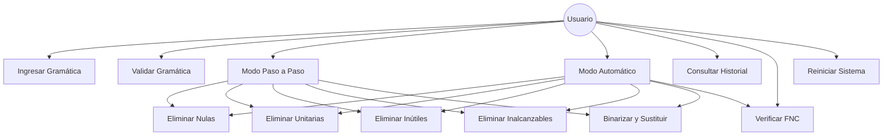
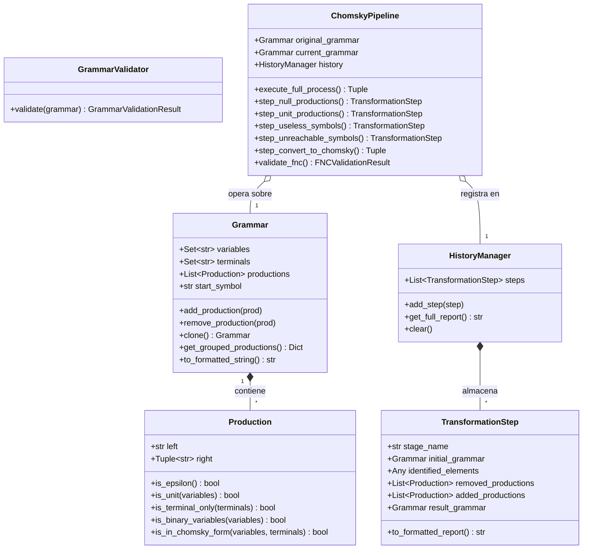
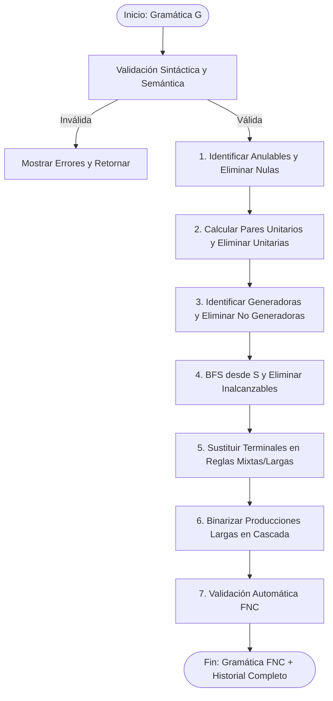

# DOCUMENTO TÉCNICO

**APLICATIVO PARA DEPURACIÓN Y CONVERSIÓN DE GRAMÁTICAS LIBRES DE CONTEXTO A FORMA NORMAL DE CHOMSKY (FNC)**

---

**Asignatura:** Teoría de la Computación  
**Semestre:** 2026-02  
**Institución:** Universidad Francisco de Paula Santander (UFPS)  
**Facultad:** Ingeniería de Sistemas  
**Autores:** Julian Gomez Ibarra (1151355) - Jesús Enrique Ruiz Acero (1152487)
**Fecha:** Septiembre 2026  

---

## 1. INTRODUCCIÓN
En la teoría de lenguajes formales y la teoría de la computación, las **Gramáticas Libres de Contexto (GLC)** constituyen la piedra angular para la especificación sintáctica de lenguajes de programación, compiladores y procesadores de lenguaje natural. No obstante, las gramáticas formuladas por el ser humano con frecuencia contienen redundancias, ambigüedades estructurales y producciones ineficientes, tales como reglas nulas ($\varepsilon$), derivaciones unitarias ($A \to B$) y símbolos no generadores o inalcanzables.

Para estandarizar estas gramáticas y permitir la aplicación eficiente de algoritmos fundamentales de análisis sintáctico —como el algoritmo CYK (*Cocke-Younger-Kasami*) que decide la pertenencia en tiempo $O(n^3)$—, es imperativo transformar la gramática a una forma canónica restringida: la **Forma Normal de Chomsky (FNC)**. 

Este proyecto presenta el diseño, fundamentación matemática, arquitectura e implementación de un aplicativo computacional modular en Python que automatiza tanto la depuración como la conversión a FNC, proporcionando trazabilidad paso a paso para fines pedagógicos y académicos.

---

## 2. PLANTEAMIENTO DEL PROBLEMA
El procedimiento manual de conversión de una GLC a Forma Normal de Chomsky involucra una secuencia rigurosa de transformaciones algebraicas:
1. Eliminación de producciones nulas.
2. Eliminación de producciones unitarias.
3. Eliminación de variables inútiles (subdividida en no generadoras e inalcanzables).
4. Sustitución de terminales en producciones mixtas/largas.
5. Binarización de producciones de longitud superior a dos.

Al realizarse manualmente en la pizarra o sobre papel, este procedimiento es sumamente propenso a errores humanos: omisión de combinaciones anulables en la expansión de subconjuntos, ciclos en cadenas de derivaciones unitarias, o renombramiento inconsistente de variables auxiliares. 

Por consiguiente, surge la necesidad de desarrollar una herramienta de software robusta, confiable y didáctica que:
- Valide formalmente los componentes de la gramática antes de procesarla.
- Aplique rigurosamente los algoritmos canónicos de la teoría de autómatas.
- Registre un historial transparente de cada etapa, evidenciando los elementos detectados, las reglas eliminadas y las reglas agregadas.
- Verifique de manera automática que la gramática final cumpla con la definición matemática de la FNC.

---

## 3. OBJETIVOS

### 3.1. Objetivo General
Desarrollar un aplicativo en Python que permita ingresar, validar, depurar y transformar una Gramática Libre de Contexto en una gramática equivalente expresada en Forma Normal de Chomsky, mostrando detalladamente cada una de las operaciones realizadas durante el proceso.

### 3.2. Objetivos Específicos
1. Registrar formalmente los cuatro componentes de una GLC: variables ($V$), terminales ($T$), producciones ($P$) y símbolo inicial ($S$).
2. Validar sintáctica y semánticamente la gramática ingresada, garantizando la disyunción entre $V$ y $T$, la pertenencia de $S \in V$ y la no existencia de símbolos no declarados.
3. Implementar el algoritmo inductivo de identificación de variables anulables y supresión combinatoria de producciones nulas ($A \to \varepsilon$).
4. Implementar el algoritmo de pares unitarios y clausura transitiva para suprimir producciones unitarias ($A \to B$).
5. Depurar símbolos inútiles identificando primero las variables generadoras mediante aproximación de punto fijo, y posteriormente las variables alcanzables mediante búsqueda en grafos desde el símbolo inicial.
6. Transformar la gramática depurada a FNC mediante sustitución de terminales con variables auxiliares y binarización en cascada de producciones largas.
7. Proveer una interfaz interactiva con dos modalidades operativas (Modo Paso a Paso y Modo Automático) y verificación automática de cumplimiento de FNC.

---

## 4. MARCO TEÓRICO
A continuación se definen con rigor matemático los conceptos fundamentales que sustentan el aplicativo:

- **Lenguaje Formal:** Subconjunto de cadenas construidas sobre un alfabeto finito: $L \subseteq \Sigma^*$.
- **Alfabeto ($\Sigma$ o $T$):** Conjunto finito y no vacío de símbolos atómicos.
- **Cadena:** Secuencia finita y ordenada de símbolos pertenecientes a un alfabeto. La longitud de una cadena $w$ se denota $|w|$.
- **Cadena Vacía ($\varepsilon$ o $\lambda$):** La única cadena de longitud cero ($|\varepsilon| = 0$). Satisface $w\varepsilon = \varepsilon w = w$.
- **Gramática Formal:** Estructura matemática generativa cuádrupla $G = (V, T, P, S)$.
- **Gramática Libre de Contexto (GLC):** Gramática de Tipo 2 en la jerarquía de Chomsky, donde cada regla de producción tiene la forma $A \to \alpha$, con $A \in V$ y $\alpha \in (V \cup T)^*$.
- **Terminales ($T$):** Símbolos que conforman las palabras válidas del lenguaje. No pueden aparecer en el lado izquierdo de una producción.
- **No Terminales / Variables ($V$):** Símbolos sintácticos intermedios que definen subestructuras y se sustituyen durante la derivación. $V \cap T = \emptyset$.
- **Producciones ($P$):** Conjunto finito de reglas de reescritura que guían la generación de cadenas.
- **Símbolo Inicial ($S$):** Variable distinguida $S \in V$ desde la cual inician todas las derivaciones del lenguaje.
- **Derivación ($\Rightarrow$ y $\Rightarrow^*$):** Relación de reescritura en la cual una cadena $\alpha A \beta$ produce $\alpha \gamma \beta$ si existe la regla $A \to \gamma$. La clausura reflexiva y transitiva se denota $\Rightarrow^*$.
- **Variable Anulable:** Una variable $A \in V$ tal que $A \Rightarrow^* \varepsilon$.
- **Producción Nula:** Una regla directa de la forma $A \to \varepsilon$.
- **Producción Unitaria:** Una regla de la forma $A \to B$, donde tanto $A$ como $B$ pertenecen a $V$.
- **Variable Generadora:** Variable $A \in V$ capaz de derivar al menos una cadena de terminales: $A \Rightarrow^* w$, con $w \in T^*$.
- **Variable No Generadora:** Variable que no puede derivar en ninguna secuencia compuesta exclusivamente por terminales (ej. ciclos infinitos sin base terminal).
- **Variable Alcanzable:** Variable $A \in V$ para la cual existen formas sentenciales $\alpha, \beta \in (V \cup T)^*$ tales que $S \Rightarrow^* \alpha A \beta$.
- **Variable Inalcanzable:** Variable que jamás puede ser alcanzada a partir del símbolo inicial $S$, sin importar las derivaciones efectuadas.
- **Variable Inútil:** Aquella variable que es no generadora o inalcanzable. No contribuye a la generación de ninguna cadena del lenguaje $L(G)$.
- **Gramática Equivalente:** Dos gramáticas $G_1$ y $G_2$ son equivalentes si generan exactamente el mismo lenguaje: $L(G_1) = L(G_2)$ (o $L(G_1) - \{\varepsilon\} = L(G_2) - \{\varepsilon\}$).
- **Forma Normal de Chomsky (FNC):** Una GLC se encuentra en FNC si todas sus producciones poseen exclusivamente una de las siguientes dos estructuras:
  $$A \to BC \quad (A, B, C \in V)$$
  $$A \to a \quad (A \in V, a \in T)$$

---

## 5. REQUERIMIENTOS DEL SISTEMA

### 5.1. Requerimientos Funcionales
- **RF01 - Crear gramática:** Permitir instanciar una nueva GLC en el sistema.
- **RF02 - Registrar variables:** Registrar el conjunto finito de símbolos no terminales $V$.
- **RF03 - Registrar terminales:** Registrar el conjunto finito de símbolos terminales $T$.
- **RF04 - Definir símbolo inicial:** Permitir seleccionar el símbolo inicial $S$.
- **RF05 - Registrar producciones:** Registrar las reglas de producción en formato individual o agrupado con tuberías (`|`).
- **RF06 - Validar gramática:** Comprobar la integridad de la gramática antes de iniciar transformaciones.
- **RF07 - Identificar producciones nulas:** Identificar el conjunto inductivo de variables anulables $V_{null}$.
- **RF08 - Eliminar producciones nulas:** Generar expansiones combinatorias y suprimir producciones a $\varepsilon$.
- **RF09 - Identificar producciones unitarias:** Detectar pares unitarios $(A, B)$ mediante clausura transitiva.
- **RF10 - Eliminar producciones unitarias:** Sustituir reglas unitarias por producciones no unitarias equivalentes.
- **RF11 - Identificar variables generadoras:** Calcular el conjunto de variables que derivan en terminales.
- **RF12 - Eliminar variables inútiles:** Podar variables no generadoras y sus producciones asociadas.
- **RF13 - Identificar variables alcanzables:** Calcular los símbolos accesibles desde $S$ mediante BFS.
- **RF14 - Eliminar variables inalcanzables:** Podar variables y producciones inaccesibles desde la raíz.
- **RF15 - Sustituir terminales:** Reemplazar terminales en producciones de longitud $\ge 2$ por nuevas variables ($X_a \to a$).
- **RF16 - Reducir producciones largas:** Binarizar reglas con más de dos variables mediante cascada binaria.
- **RF17 - Crear variables auxiliares:** Generar nombres únicos garantizados ($X_1, X_2, \dots$) sin colisiones.
- **RF18 - Mostrar cada transformación:** Reportar por etapa: gramática antes, elementos detectados, eliminadas, agregadas y gramática resultante.
- **RF19 - Mostrar gramática final:** Desplegar la gramática resultante en FNC.
- **RF20 - Reiniciar proceso:** Permitir vaciar el estado actual e ingresar una nueva gramática sin reiniciar el programa.

### 5.2. Requerimientos No Funcionales
- **RNF01:** Interfaz clara, interactiva y comprensible con soporte de consola estructurada.
- **RNF02:** Mensajes de error y validación descriptivos e inequívocos.
- **RNF03:** Organización modular en capas (modelos, parsers, algoritmos, historial, UI).
- **RNF04:** Nombres descriptivos en métodos y clases bajo convenciones PEP 8.
- **RNF05:** Documentación interna y comentarios exhaustivos en cada algoritmo.
- **RNF06:** Capacidad para procesar gramáticas arbitrarias y generales, sin depender de casos fijos.
- **RNF07:** Preservación del lenguaje formal generado (salvo tratamiento canónico de $\varepsilon$).
- **RNF08:** Prevención estricta de producciones duplicadas.
- **RNF09:** Nombres únicos garantizados para variables auxiliares generadas.
- **RNF10:** Registro determinista de todo el historial de cambios.
- **RNF11:** Reproducibilidad garantizada: ante la misma gramática, se produce siempre el mismo resultado.
- **RNF12:** Validación automática al finalizar el proceso mediante verificador formal FNC.

---

## 6. ANÁLISIS Y DISEÑO DEL SISTEMA

### 6.1. Diagrama de Casos de Uso


### 6.2. Diagrama de Clases (UML)


### 6.3. Diagrama de Flujo del Proceso Canónico


---

## 7. ALGORITMOS IMPLEMENTADOS

### 7.1. Eliminación de Producciones Nulas ($A \to \varepsilon$)
1. **Detección de Variables Anulables ($V_{null}$):**
   - Base: $V_{null}^{(0)} = \{ A \in V \mid A \to \varepsilon \in P \}$.
   - Inducción: $V_{null}^{(i+1)} = V_{null}^{(i)} \cup \{ A \in V \mid \exists A \to Y_1 Y_2 \dots Y_k \in P \land \forall j, Y_j \in V_{null}^{(i)} \}$.
   - Criterio de parada: $V_{null}^{(i+1)} = V_{null}^{(i)}$.
2. **Generación de Producciones Equivalentes:**
   - Para cada regla $A \to \alpha$, se calculan las posiciones de símbolos que pertenecen a $V_{null}$.
   - Se generan las $2^k$ combinaciones (donde $k$ es el número de ocurrencias anulables), excluyendo la regla resultante si queda vacía ($\varepsilon$).
   - Se eliminan todas las reglas directas $A \to \varepsilon$.

### 7.2. Eliminación de Producciones Unitarias ($A \to B$)
1. **Cálculo de Pares Unitarios:**
   - Base: $(A, A)$ para todo $A \in V$ (reflexividad).
   - Inducción: Si $(A, B)$ es un par unitario y existe $B \to C \in P$ con $C \in V$, se agrega $(A, C)$.
2. **Sustitución Efectiva:**
   - Para cada par $(A, B)$, si existe $B \to \alpha$ con $\alpha \notin V$, se agrega la producción $A \to \alpha$.
   - Se suprimen todas las reglas unitarias $A \to B$.

### 7.3. Eliminación de Variables Inútiles
El algoritmo opera en dos fases desacopladas:
1. **Fase 1: Variables Generadoras ($V_{gen}$):**
   - Base: $V_{gen}^{(0)} = \{ A \in V \mid \exists A \to w \in P, w \in T^* \}$.
   - Inducción: $V_{gen}^{(i+1)} = V_{gen}^{(i)} \cup \{ A \in V \mid \exists A \to \alpha \in P, \alpha \in (T \cup V_{gen}^{(i)})^* \}$.
   - Se eliminan todas las variables $A \notin V_{gen}$ y toda regla que las contenga en su lado izquierdo o derecho.
2. **Fase 2: Variables Alcanzables ($V_{reach}$):**
   - Se ejecuta una búsqueda en anchura (BFS) iniciando desde el símbolo inicial $S$.
   - Si una variable no puede ser alcanzada a partir de $S$, se elimina junto con sus producciones.

### 7.4. Conversión a FNC
1. **Sustitución de Terminales (RF15):**
   - Para cada producción con $|\alpha| \ge 2$, cada terminal $a \in T$ presente se reemplaza por una variable auxiliar $X_a$ única.
   - Se añade la regla $X_a \to a$.
2. **Binarización de Producciones Largas (RF16, RF17):**
   - Dada una regla $A \to Y_1 Y_2 Y_3 \dots Y_k$ con $k > 2$:
     - Se reemplaza por $A \to Y_1 X_1$.
     - $X_1 \to Y_2 X_2$.
     - $\dots$
     - $X_{k-2} \to Y_{k-1} Y_k$.
   - Cada variable auxiliar $X_i$ tiene un identificador único garantizado que no colisiona con variables preexistentes.

---

## 8. IMPLEMENTACIÓN Y ORGANIZACIÓN DEL CÓDIGO
El proyecto fue construido en **Python 3.12** aprovechando tipado estático opcional (`typing`) y siguiendo principios de Clean Code y SOLID:

- `src/models/production.py`: Encapsula la regla de producción con métodos de consulta semántica (`is_epsilon`, `is_unit`, `is_in_chomsky_form`).
- `src/models/grammar.py`: Representación formal $G = (V, T, P, S)$, clonado profundo y formateo determinista.
- `src/parser/validator.py`: Validador formal (RF06, RNF02).
- `src/parser/grammar_parser.py`: Lector y analizador sintáctico de texto libre de gramáticas.
- `src/algorithms/null_productions.py`: Eliminador de producciones nulas (RF07, RF08).
- `src/algorithms/unit_productions.py`: Eliminador de producciones unitarias (RF09, RF10).
- `src/algorithms/useless_symbols.py`: Depuración de símbolos no generadores e inalcanzables (RF11 - RF14).
- `src/algorithms/chomsky_converter.py`: Transformador FNC (RF15 - RF17).
- `src/algorithms/fnc_validator.py`: Validador formal de FNC (RF19, RNF12).
- `src/algorithms/chomsky_pipeline.py`: Orquestador desacoplado para los modos paso a paso y automático.
- `src/history/transformation_step.py`: Registro de trazabilidad y reportes por etapa (RF18, RNF10).
- `src/ui/console_menu.py`: Menú interactivo estructurado con las 13 opciones de la rúbrica.
- `main.py`: Punto de entrada de la aplicación.

---

## 9. PRUEBAS Y VALIDACIÓN EXPERIMENTAL

### Caso de Prueba 1: Gramática con Producciones Nulas y Unitarias
- **Gramática Inicial:**
  ```text
  V = { S, A, B, C, D }
  T = { a, b, d }
  S = S
  P = {
      S -> ABaC
      A -> BC | ε
      B -> b | ε
      C -> D
      D -> d
  }
  ```
- **Proceso Ejecutado:**
  1. *Nulas:* $V_{null} = \{A, B\}$. Se generan combinaciones en $S \to ABaC$ ($S \to BaC \mid AaC \mid aC \mid ABaC$) y en $A \to BC$.
  2. *Unitarias:* $C \to D$ se sustituye por $C \to d$.
  3. *Inútiles e Inalcanzables:* Todas las variables son generadoras y alcanzables.
  4. *FNC:* Terminales sustituidos ($X_1 \to a, X_2 \to b, X_3 \to d$) y binarización de reglas largas.
- **Resultado Obtenido:** Todas las reglas cumplen $A \to BC$ o $A \to a$. El verificador arrojó `[EXITO]`.

### Caso de Prueba 2: Gramática Clásica de Hopcroft & Ullman
- **Gramática Inicial:**
  ```text
  V = { S, A, B }
  T = { a, b }
  S = S
  P = {
      S -> aB | bA
      A -> a | aS | bAA
      B -> b | bS | aBB
  }
  ```
- **Resultado Obtenido:**
  ```text
  V = { A, B, S, X1, X2, X3, X4 }
  T = { a, b }
  S = S
  P = {
      S -> X2 A | X1 B
      A -> X1 S | a | X2 X3
      B -> X2 S | X1 X4 | b
      X1 -> a
      X2 -> b
      X3 -> AA
      X4 -> BB
  }
  ```
  Cumple 100% con la Forma Normal de Chomsky.

---

## 10. RESULTADOS Y CONCLUSIONES
- Se diseñó e implementó exitosamente un software robusto, determinista y modular que automatiza el proceso completo de transformación de GLC a FNC.
- La arquitectura basada en el patrón Pipeline desacopla la lógica algorítmica de la presentación en consola, facilitando tanto el modo paso a paso como la ejecución continua.
- La validación automática final (RNF12) certifica formalmente que ninguna producción residual viole las restricciones de Chomsky.
- La suite de pruebas automatizadas garantiza la reproducibilidad y estabilidad del código ante diversos casos de borde.

---

## 11. REFERENCIAS BIBLIOGRÁFICAS
1. Hopcroft, J. E., Motwani, R., & Ullman, J. D. (2007). *Introduction to Automata Theory, Languages, and Computation* (3rd ed.). Pearson / Addison-Wesley.
2. Sipser, M. (2013). *Introduction to the Theory of Computation* (3rd ed.). Cengage Learning.
3. Linz, P. (2016). *An Introduction to Formal Languages and Automata* (6th ed.). Jones & Bartlett Learning.
4. Martin, J. C. (2010). *Introduction to Languages and the Theory of Computation* (4th ed.). McGraw-Hill.
